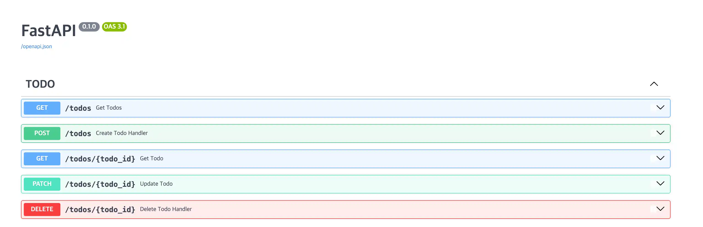

# 라우터 구조화(Router Structuring)
<b>라우터(Router)</b>란, 웹 애플리케이션에서 여러 API를 기능별로 구분해 한곳에 모아 두기 위한 단위이다.
라우터를 사용하면 서로 관련된 API 엔드포인트들을 하나의 모듈로 묶을 수 있어 코드를 기능 단위로 정리하고 관리하기 수월하다. 

<b>라우팅(Routing)</b>은 클라이언트로부터 들어온 요청(HTTP 메소드 + URL 경로)을 어떤 함수가 처리할지 연결하는 과정이다. 예를 들어 GET /tods 요청은 전체 할 일을 조회하는 함수로, POST /users 요청은 사용자를 생성하는 함수로 각각 연결되며, 이러한 연결 과정을 관리하는 역할을 라우터가 한다.

## 1. 라우터 구조화 방법: APIRouter 클래스
```python { 4 }
# main.py
from fastapi import FastAPI

app = FastAPI()

@app.get(...)
@app.post(...)
@app.delete(...)
...
```
라우터가 없을 땐 FastAPI 클래스의 객체를 만들고 데코레이터 문법을 통해 엔드포인트를 구성하게 된다.
FastAPI 객체는 브라우저나 클라이언트의 요청이 Uvicorn같은 웹 서버에 도착하고, 이 요청을 FastAPI 객체가 받아 적절히 매핑시켜준다.

시간이 지나고 기능이 커져가면서 하나의 파일에 모든 엔드포인트 함수를 작성하면 관리가 어려워진다.
또한 파일을 나누지만, main.py의 app 변수를 import하여 사용할 경우 순환참조 문제가 발생할 여지가 있다.

이 문제를 해결하기 위해 FastAPI는 APIRouter 클래스를 제공한다.
APIRouter를 사용하면 순환 참조 문제를 해결하면서도 API를 기능 단위로 구조화하여 관리할 수 있는 깔끔한 구조를 만들 수 있다.

<Callout type="info" title="Q. 도메인별 엔드포인트 파일을 여러개 만들고 FastAPI 객체를 여러개 생성하면 되지 않을까?">
   FastAPI의 객체를 생성한다는건, 서버를 생성한다는 것과 동일한 의미이다.
   만약, 도메인 파일마다 FastAPI 객체를 생성하게 된다면 서버를 각각 생성한다는 의미가 된다.
    <br/>
   의도에 따라 여러개의 FastAPI 객체로 나누고 이를 하나로 묶는 마운트(Sub-application)기능을 사용하기도 한다. 보통 완전히 별개의 레거시 프로젝트나 서비스를 하나의 도메인 하위로 묶을 때만 제한적으로 사용한다.
</Callout>

### 1-1. APIRouter 사용예시
```python { 4, 6, 7, 8, 15 }
# routers/todos.py
from fastapi import APIRouter

router = APIRouter(tags=["TODO"])

@router.get(...)
@router.post(...)
@router.delete(...)

# main.py
from fastapi import FastAPI
from router.todos import router as todo_router

app = FastAPI()
app.include_router(todo_router)
...
```

여기서는 예시 기반으로 기술한다.

main.py에 작성된 기존 엔드포인트들을 todos.py 파일로 옮기고, 각각의 엔드포인트를 APIRouter 객체의 데코레이션을 이용하는 방법으로 수정해준다. 아후, 기존에 작성된 main.py의 경로에 들어가 라우터를 등록해준다.


**router = APIRouter(tags=["TODO"])** 코드의 tags 속성은 Swagger Docs 내부의 문서 그룹을 TODO로 묶기 위함이다. 만약 태그를 주지 않는다면 todo.py의 엔드포인트들은 default라는 그룹에 묶이게 될 것이다.