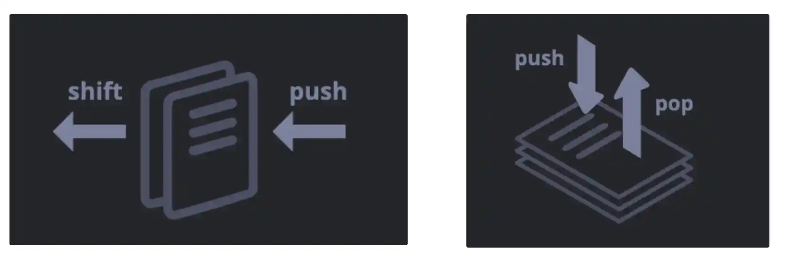

#### 학습 자료: https://ko.javascript.info/array

## 1. 배열
키를 사용해 식별할 수 있는 값을 담은 컬렉션은 객체라는 자료구조를 이용해 저장하는데, 객체만으로도 다양한 작업을 할 수 있다.

그런데 개발을 진행하다 보면 첫 번째 요소, 두 번째 요소, 세 번째 요소 등과 같이 순서가 있는 컬렉션이 필요할 때가 생기곤 한다. 사용자나 물건, HTML 요소 목록같이 일목요연하게 순서를 만들어 정렬하기 위해서 말이다.

### 1-1. 배열 선언
```javascript
let arr = new Array();
let arr = [];
let arr = ['사과', '오렌지', '자두'];
```
위의 두 문법을 사용하면 빈 배열을 만들 수 있다. 대부분은 두 번째 방법으로 배열을 선언한다. 
이때 세 번째 방법처럼 대괄호 안에 초기 요소를 넣어주는 것도 가능하다.
각 배열 요소엔 0부터 시작하는 숫자(인덱스)가 매겨져 있으며 이 숫자들은 배열 내 순서를 나타낸다.

🧑🏻‍💻[예제 코드] 배열 내 특정 요소를 얻는 방법
```javascript
let fruits = ["사과", "오렌지", "자두"];

alert( fruits ); // 사과,오렌지,자두
alert( fruits[0] ); // 사과
alert( fruits[1] ); // 오렌지
alert( fruits[2] ); // 자두

fruits[0]='키위';
alert( fruits ); // 키위,오렌지,자두

fruits[3]='체리'
alert( fruits ); // 키위,오렌지,자두,체리

alert( fruits.length ); // 4
```
배열 내 특정 요소를 얻고 싶다면 대괄호 안에 순서를 나타내는 숫자인 인덱스를 넣어주면 된다.
또한 기존 배열의 값을 수정할 때는 위의 코드 `fruits[0]='키위';`처럼 사용해주면 된다.
또한 기존 배열의 값을 추가하고 싶다면 위의 코드 `fruits[3]='체리';` 처럼 사용해주면 된다.
또한 기존 배열의 길이를 알고 싶다면 `length` 프로퍼티를 사용하면 된다.

### ⭐️ 1-2. 배열 요소의 자료형엔 제약이 없다.
🧑🏻‍💻[예제 코드] 배열 요소에 여러 가지 자료형이 섞여 있는 경우:
```javascript
let arr = [ 
  '사과', 
  { name: '이보라' }, 
   true, 
   function() { alert('안녕하세요.'); } 
  ];

alert( arr[1].name ); // 이보라, 인덱스가 1인 요소(객체)의 name 프로퍼티를 출력
arr[3](); // 안녕하세요., 인덱스가 3인 요소(함수)를 실행
```
배열 요소엔 자료형 제약이 없으며 다양한 자료형을 넣어줄 수 있다.

### ⭐️ 1-3. pop·push와 shift·unshift
🧑🏻‍💻[예제 코드] pop, push, shift, unshift 사용:
```javascript
let fruits = ["사과", "오렌지", "배"];

// pop
alert( fruits.pop() ); // 배열에서 "배"를 제거하고, 팝업을 띄운다.
alert( fruits ); // 사과,오렌지

// push
fruits.push("배");// 배열의 끝에 "배"를 추가한다.
alert( fruits ); // 사과,오렌지,배

// shift
alert( fruits.shift() ); // 배열에서 "사과"를 제거하고, 팝업을 띄운다.
alert( fruits ); // 오렌지,배

// unshift
fruits.unshift("키위"); // 배열에서 "키위"를 추가한다.
alert( fruits ); // 키위, 오렌지,배
```

|배열 메소드|설명|
|---|---|
|push| 맨 끝에 요소를 추가한다. 요소간 `,`를 이용하면 여러 개를 한 번에 더해줄 수도 있다.|
|unshift| 처음에 요소를 추가한다. 요소간 `,`를 이용하면 여러 개를 한 번에 더해줄 수도 있다.|
|shift| 제일 앞 요소를 꺼내 제거하고, 남아있는 요소들을 앞으로 밀어준다.|
|pop| 스택 끝 요소를 추출한다.|

자료구조 관점에서 `스택`, `큐`, `데큐`를 간단히 설명하면 아래와 같다.
- 스택: FIFO구조로, 마지막에 들어간 요소가 가장 먼저 출력된다. 시간 복잡도는 O(1)을 보장해야 한다.
- 큐: LIFO구조로, 처음에 들어간 요소가 가장 먼저 출력된다. 시간 복잡도는 O(1)을 보장해야 한다.
- 데큐: 요소의 삽입과 출력을 앞과 뒤 어디서든 가능하다. 시간 복잡도는 O(1)을 보장해야 한다.

Javascript는 `push`, `unshift`, `shift`, `pop` 연산으로 스택, 큐, 데큐를 모두 구현한 것처럼 보인다. 

<font color="salmon"> <b>하지만 주의할 것이 있다.</b></font> <b><u>`shift`와 `unshift`는 치명적인 단점이 존재한다.</u></b>
이 연산들을 사용하면 특정 위치의 자리에 데이터를 넣거나 빼게 되는데, <font color="steelblue"><b>그 뒤에 연속적으로 따라오는 데이터가 자신의 원래 자리를 잃게 된다.</b></font> 이 문제를 극복하기 위해 <b>Javascript 엔진은 뒤에 있는 모든 데이터의 인덱스 번호를 하나씩 전부 다시 매겨서 이동시키는 막노동을 시킨다.</b> 이는 시간복잡도 `O(N)`의 결과를 초래한다.

즉, Javascript 배열은 겉보기엔 `데큐`를 기반으로 동작하는 것으로 보이지만 `O(1)`을 보장하지 못하므로 가짜 데큐로 이해할 수 있다. 이러한 이유로 큐가 필요할 때 배열의 `shift()`를 절대 사용하지 않고, 
인덱스(포인터)를 이동시키는 방식을 사용하거나 직접 큐(Queue)객체를 구현하는 것이 올바르다. 이는 기회가 된다면 설명하겠다.

### ⭐️ 1-4. 배열의 내부 동작 원리
배열은 특별한 종류의 객체이다. 배열은 <b>숫자형 키</b>를 사용함으로써 객체 기본 기능 이외에도 순서가 있는 컬렉션을 제어하게 해주는 특별한 메서드를 제공한다. `length`라는 프로퍼티도 제공한다. 
어찌됐건, <b>배열의 본질은 객체이다.</b>

🧑🏻‍💻[예제 코드] 배열은 참조를 통해 복사가 된다:
```javascript
let fruits = ["바나나"]
let arr = fruits; // 참조를 복사함(두 변수가 같은 객체를 참조)

alert( arr === fruits ); // true

arr.push("배"); // 참조를 이용해 배열을 수정한다.

alert( fruits ); // 바나나,배 -> 요소가 두 개가 되었다
```
이렇게 배열은 Javascript의 일곱 가지 원시 자료형에 해당하지 않고, 원시 자료형이 아닌 객체형에 속하기 때문에 객체처럼 동작한다. 위의 코드는 배열의 참조 복사라는 것을 보이는 코드이다.
배열을 배열답게 만들어주는 것은 특수 내부 표현방식이다. 자바스크립트 엔진은 배열의 요소를 인접한 메모리 공간에 차례로 저장해 연산 속도를 높인다. 이 방법 이외에도 배열 관련 연산을 더 빠르게 해주는 최적화 기법은 다양하다.

그런데 개발자가 배열을 '순서가 있는 자료의 컬렉션’처럼 다루지 않고 일반 객체처럼 다루면 이런 기법들이 제대로 동작하지 않는다.

⭐️ ⚠️[예제 코드] 배열을 일반 객체처럼 다루는 예시:
```javascript
let fruits = []; // 빈 배열을 하나 만든다.

fruits[99999] = 5; // 배열의 길이보다 훨씬 큰 숫자를 사용해 프로퍼티를 만든다.
fruits.age = 25; // 임의의 이름을 사용해 프로퍼티를 만든다.
```
배열은 객체이기 때문에 예시처럼 원하는 프로퍼티를 추가해도 문제가 발생되지 않는다.

그런데 이렇게 코드를 작성하면 Javascript 엔진이 배열을 일반 객체처럼 다루게 되어 배열을 다룰 때만 적용되는 최적화 기법이 동작하지 않아 배열 특유의 이점이 사라지게 된다. 잘못된 방법의 예는 아래와 같다.
- `arr.test = 5` 같이 숫자가 아닌 값을 프로퍼티 키로 사용하는 경우
- `arr[0]`과 `arr[1000]`만 추가하고 그사이에 아무런 요소도 없는 경우
- `arr[1000]`, `arr[999]`같이 요소를 역순으로 채우는 경우

배열은 <b><u>순서가 있는 자료</u></b>를 저장하는 용도로 만들어진 특수한 자료구조이다.  
배열 내장 메서드들은 이런 용도에 맞게 만들어졌다. <b><u>자바스크립트 엔진은 이런 특성을 고려하여 배열을 신중하게 조정하고, 처리하므로 배열을 사용할 땐 이런 목적에 맞게 사용해야 한다.</u></b>  
임의의 키를 사용해야 한다면 배열보단 일반 객체 {}가 적합한 자료구조일 확률이 높다.

### ⭐️ 1-5. 배열의 반복문 `for..of`와 `for..in`
이번 챕터에서 가장 중요한 것은 `for..of`와 `for..in`모두 배열 순회에 사용이 가능하지만
`for..in`의 사용은 되도록이면 지양해야한다는 것이다.

⚠️ for..in을 지양해야하는 이유
1. `for..in`반복문은 모든 프로퍼티를 대상으로 순회한다. 키가 숫자가 아닌 프로퍼티도 순회 대상에 포함된다.
    - 브라우저나 기타 호스트 환경에서 쓰이는 객체 중, 배열과 유사한 형태를 보이는 ‘유사 배열(array-like)’ 객체가 있다. 유사 배열 객체엔 배열처럼 `length`프로퍼티도 있고, 요소마다 인덱스도 붙어있다. 
    그런데, 여기에 더하여 유사 배열 객체엔 배열과는 달리 키가 숫자형이 아닌 프로퍼티와 메서드가 있을 수 있다. 유사 배열 객체와 `for..in`을 함께 사용하면 이 모든 것을 대상으로 순회가 이뤄진다. 따라서 "필요 없는" 프로퍼티들이 문제를 일으킬 가능성이 생긴다.

2. `for..in` 반복문은 배열이 아니라 객체와 함께 사용할 때 최적화되어 있어서 배열에 사용하면 객체에 사용하는 것 대비 10~100배 느리다.
    - `for..in`반복문의 속도가 대체로 빠른 편이기 때문에 병목 지점에서만 문제가 되긴하나, `for..in`반복문을 사용할 땐 이런 차이를 알고 적절하게 사용해야한다. (안 쓰는 것이 바람직하다.)


🧑🏻‍💻 [예제 코드] `for..of`와 `for..in` 사용 예제:
```javascript
let fruits = ["사과", "오렌지", "자두"];

// 배열 요소를 대상으로 반복 작업을 수행
for (let fruit of fruits) {
  alert( fruit ); // 사과 -> 오렌지 -> 자두 출력
}

// 배열 키를 대상으로 반복 작업을 수행
for (let key in arr) {
  alert( arr[key] ); // 사과 -> 오렌지 -> 자두 출력
}
```
`for..of`를 사용하면 현재 요소의 인덱스는 얻을 수 없고 값만 얻을 수 있다.
`for..in`를 사용하면 키를 대상으로 반복작업 수행이 가능하다. 하지만 지양해야한다.

### ⭐️ 1-6. `length` 프로퍼티
배열에 무언가 조작을 가하면 `length` 프로퍼티가 자동으로 갱신된다.

🧑🏻‍💻[예제 코드] `length`의 값을 감소시키는 예제:
```javascript
let arr = [1, 2, 3, 4, 5];

arr.length = 2; // 요소 2개만 남기고 자른다.
alert( arr ); // [1, 2]

arr.length = 5; // 본래 길이로 되돌려 보자.
alert( arr[3] ); // undefined: 삭제된 기존 요소들이 복구되지 않는다
```
`length`의 독특한 특징 중 하나는 쓰기가 가능하다는 것이다.
`length`의 값을 수동으로 증가시키면 아무 일도 일어나지 않지만 값을 감소시키면 배열이 잘린다. 
짧아진 배열은 다시 되돌릴 수 없다. 이러한 특징을 사용하면 `arr.length = 0`을 사용해 간단히 배열을 비울 수 있다.

### 1-7. 다차원 배열
```javascript
let matrix = [
  [1, 2, 3],
  [4, 5, 6],
  [7, 8, 9]
];

alert( matrix[1][1] ); // 5, 중심에 있는 요소
```
배열 역시 배열의 요소가 될 수 있으며, 이런 배열을 다차원 배열이라고 부른다.
다차원 배열은 행렬을 저장하는 용도로 사용된다.

### 1-8. toString
```javascript
let arr = [1, 2, 3];

alert( arr ); // 1,2,3
alert( String(arr) === '1,2,3' ); // true
alert(arr === '1,2,3') //false, 배열타입은 Object로 평가되어지고 문자는 String 이기 때문에 불일치
```
배열엔 `toString` 메서드가 구현되어 있어 이를 호출하면 요소를 쉼표로 구분한 문자열이 반환된다.

```javascript
alert( [] + 1 ); // "1"
alert( [1] + 1 ); // "11"
alert( [1,2] + 1 ); // "1,21"
```
배열엔 `Symbol.toPrimitive`나 `valueOf` 메서드가 없다.
예시에선 문자열로의 형 변환이 일어나 `[]`는 `빈 문자열`, `[1]`은 문자열 `"1"`, `[1,2]`는 문자열 `"1,2"`로 변환된다.

설명을 조금 더 보태면 숫자가 아닌 문자열에서의 `+`는 문자를 이어붙인다. 
배열은 `+`연산자를 만나는 순간 내부적으로 문자열로 바꾸는 `toString()`메서드를 자동으로 호출한다. 
배열의 `toString()`메서드는 배열 안의 요소들을 쉼표로 이어 붙인 문자열을 반환하도록 설계되었다.
