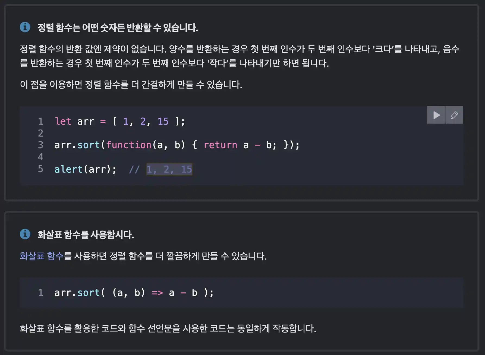
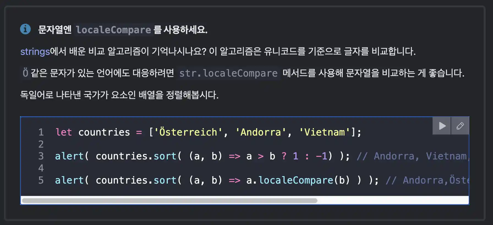
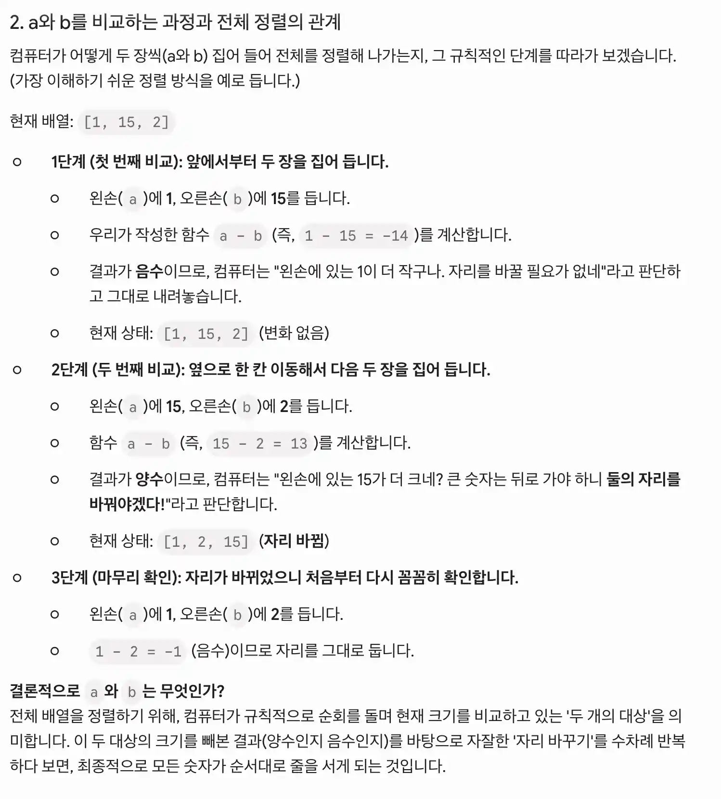
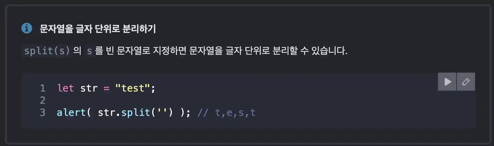
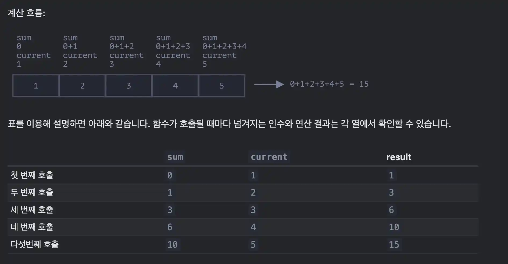

#### 학습 자료: https://ko.javascript.info/array-methods

## 1. 배열과 메소드
### 1-1. `delete`
```javascript
let arr = ["I", "go", "home"];

delete arr[1]; // "go"를 삭제한다.
alert( arr[1] ); // undefined

alert( arr.length ); // 3, delete를 써서 요소를 지우고 난 후 배열 --> arr = ["I",  , "home"];
```
배열에서 요소를 지운다. 하지만, <b>배열의 길이는 줄어들지 않는다.</b>

### 1-2. `splice`
🌱 [개념] 
```javascript
arr.splice(index[, deleteCount, elem1, ..., elemN])
```
첫 번째 매개변수는 조작을 가할 첫 번째 요소를 가리키는 인덱스이다.
두 번째 매개변수는 deleteCount로, 제거하고자 하는 요소의 개수를 나타낸다. 
`elem1, ..., elemN`은 배열에 추가할 요소를 나타낸다.

🧑🏻‍💻[예제 코드] splice의 사용 (1):
```javascript
let arr = ["I", "study", "JavaScript"];

arr.splice(1, 1); // 인덱스 1부터 요소 한 개를 제거

alert( arr ); // ["I", "JavaScript"]
```
인덱스 1이 가리키는 요소부터 시작해 요소 한 개를 지운 예시이다.

🧑🏻‍💻[예제 코드] splice의 사용 (2):
```javascript
let arr = ["I", "study", "JavaScript", "right", "now"];

// 처음(0) 세 개(3)의 요소를 지우고, 이 자리를 다른 요소로 대체한다.
arr.splice(0, 3, "Let's", "dance");

alert( arr ) // now ["Let's", "dance", "right", "now"]
```
요소 세 개(3)를 지우고, 그 자리를 다른 요소 두 개로 교체한다.

🧑🏻‍💻[예제 코드] splice의 반환값은 삭제된 요소로 구성된 배열이다. :
```javascript
let arr = ["I", "study", "JavaScript", "right", "now"];

// 처음 두 개의 요소를 삭제함
let removed = arr.splice(0, 2);

alert( removed ); // "I", "study" <-- 삭제된 요소로 구성된 배열
```
splice는 삭제된 요소로 구성된 배열을 반환한다.

🧑🏻‍💻[예제 코드] splice의 deleteCount를 0으로 설정하면 요소를 제거하지 않고 새로운 요소 추가가 가능하다. :
```javascript
let arr = ["I", "study", "JavaScript"];

// 인덱스 2부터
// 0개의 요소를 삭제한다.
// 그 후, "complex"와 "language"를 추가한다.
arr.splice(2, 0, "complex", "language");

alert( arr ); // "I", "study", "complex", "language", "JavaScript"
```
splice의 deleteCount를 0으로 설정하면 요소를 제거하지 않고 새로운 요소 추가가 가능하다.

🧑🏻‍💻[예제 코드] splice의 음수 인덱스 사용 :
```javascript
let arr = [1, 2, 5];

// 인덱스 -1부터 (배열 끝에서부터 첫 번째 요소)
// 0개의 요소를 삭제하고
// 3과 4를 추가한다.
arr.splice(-1, 0, 3, 4);

alert( arr ); // 1,2,3,4,5
```
예제는 slice 메서드에 음수를 사용한 경우이지만 slice 메서드 뿐만 아니라 배열 관련 메서드엔 음수 인덱스를 사용할 수 있다. 이때 마이너스 부호 앞의 숫자는 배열 끝에서부터 센 요소 위치를 나타낸다.

### 1-3. `slice`
`arr.slice`는 `arr.splice`와 유사해 보이지만 훨씬 간단하다.

🌱 [문법] 
```javascript
arr.slice([start], [end])
```
`start`인덱스부터(`end`를 제외한) `end`인덱스까지의 요소를 복사한 새로운 배열을 반환한다.
`start`와 `end`는 둘 다 음수일 수 있는데 이땐, 배열 끝에서부터의 요소 개수를 의미한다.

🧑🏻‍💻 [예제 코드] slice의 사용 :
```javascript
let arr = ["t", "e", "s", "t"];

let s1 = arr.slice(1,3); // e,s (인덱스가 1인 요소부터 인덱스가 3인 요소까지를 복사(인덱스가 3인 요소는 제외))
let s2 = arr.slice(-2); // s,t (인덱스가 -2인 요소부터 제일 끝 요소까지를 복사)

alert( s1 ); // e,s
alert( s2 ); // s,t
alert( typeof s1 ) //object
alert(arr); // t,e,s,t
```
`slice`의 `end`의 위치는 포함하지 않으며 "미만"이라고 생각하자.
`arr.slice`는 문자열 메서드인 `str.slice`와 유사하게 동작하는데 `arr.slice`는 서브 문자열(substring) 대신 서브 배열(subarray)을 반환한다.

쉽게 생각하면 아래와 같다.


### 1-4. `concat`
🌱[문법]
```javascript
arr.concat(arg1, arg2...)
```
`arr.concat`은 기존 배열의 요소를 사용해 새로운 배열을 만들거나 기존 배열에 요소를 추가하고자 할 때 사용한다.

🧑🏻‍💻 [예시 코드] concat의 사용 :
```javascript
let arr = [1, 2];

// arr의 요소 모두와 [3,4]의 요소 모두를 한데 모은 새로운 배열이 만들어집니다.
alert( arr.concat([3, 4]) ); // 1,2,3,4

// arr의 요소 모두와 [3,4]의 요소 모두, [5,6]의 요소 모두를 모은 새로운 배열이 만들어집니다.
alert( arr.concat([3, 4], [5, 6]) ); // 1,2,3,4,5,6

// arr의 요소 모두와 [3,4]의 요소 모두, 5와 6을 한데 모은 새로운 배열이 만들어집니다.
alert( arr.concat([3, 4], 5, 6) ); // 1,2,3,4,5,6
```
인수엔 배열이나 값이 올 수 있는데, 인수 개수엔 제한이 없다.
메서드를 호출하면 `arr`에 속한 모든 요소와 `arg1`, `arg2` 등에 속한 모든 요소를 한데 모은 새로운 배열이 반환된다. 인수 `argN`가 배열일 경우 배열의 모든 요소가 복사된다. 그렇지 않은경우(단순 값인 경우)는 인수가 그대로 복사된다.

<br/>

```javascript
let arr = [1, 2];

let arrayLike = {
  0: "something",
  length: 1
};

alert( arr.concat(arrayLike) ); // 1,2,[object Object]
```
`concat` 메서드는 제공받은 배열의 요소를 복사해 활용한다. 
객체가 인자로 넘어오면 (배열처럼 보이는 유사 배열 객체이더라도) 객체는 분해되지 않고 통으로 복사되어 더해진다.

### 1-5. forEach로 반복 작업하기
🌱 [문법]
```javascript
arr.forEach(function(item, index, array) {
  // 요소에 무언가를 할 수 있습니다.
});
```
`arr.forEach`는 주어진 함수를 배열 요소 각각에 대해 실행할 수 있게 해준다.

🧑🏻‍💻 [예제 코드] 요소 모두를 얼럿창을 통해 출력해주는 코드 :
```javascript
------------------------------------------------------------------
// for each element call alert
["Bilbo", "Gandalf", "Nazgul"].forEach(alert);
------------------------------------------------------------------
["Bilbo", "Gandalf", "Nazgul"].forEach((item, index, array) => {
  alert(`${item} is at index ${index} in ${array}`);
});
------------------------------------------------------------------
```
요소 모두를 얼럿창을 통해 출력해주는 코드이다.
참고로 두 번째는 인덱스 정보까지 더해서 출력해주는 좀 더 정교한 코드이다.

### 1-6. 배열 탐색하기
배열 내에 무언가를 찾고 싶을 때 쓰는 메서드를 알아보겠다.

#### ⭐️ 1-6-1. `indexOf`, `lastIndexOf`와 `includes`
`arr.indexOf`와 `arr.lastIndexOf`, `arr.includes`는 같은 이름을 가진 문자열 메서드와 문법이 동일하다.
연산 대상이 문자열이 아닌 배열의 요소라는 점만 다르다.
- `arr.indexOf(item, from)`는 인덱스 from부터 시작해 item(요소)을 찾는다. 
  요소를 발견하면 해당 요소의 인덱스를 반환하고, 발견하지 못했으면 -1을 반환한다.
- `arr.lastIndexOf(item, from)`는 위 메서드와 동일한 기능을 하는데, 검색을 끝에서부터 시작한다는 점만 다르다.
- `arr.includes(item, from)`는 인덱스 from부터 시작해 item이 있는지를 검색하는데, 해당하는 요소를 발견하면 true를 반환한다.


🧑🏻‍💻 [예시 코드]
```javascript
let arr = [1, 0, false];

alert( arr.indexOf(0) ); // 1
alert( arr.indexOf(false) ); // 2
alert( arr.indexOf(null) ); // -1

alert( arr.includes(1) ); // true
```
위 메서드들은 요소를 찾을 때 완전 항등 연산자 === 을 사용한다.

🧑🏻‍💻 [예시 코드] `includes`는 `NaN`도 제대로 처리한다는 점에서 `indexOf`/`lastIndexOf`와 약간의 차이가 있다. :
```javascript
const arr = [NaN];
alert( arr.indexOf(NaN) ); // -1 (완전 항등 비교 === 는 NaN엔 동작하지 않으므로 0이 출력되지 않는다.)
alert( arr.includes(NaN) );// true (NaN의 여부를 확인했다.)
```

#### ⭐️ 1-6-2. `find`와 `findIndex`
객체로 이루어진 배열이 있다고 가정해 보자. 특정 조건에 부합하는 객체를 배열 내에서 어떻게 찾을 수 있을까?
이럴 때 arr.find(fn)을 사용할 수 있다.

🌱 [문법] find
```javascript
let result = arr.find(function(item, index, array) {
  // true가 반환되면 반복이 멈추고 해당 요소를 반환한다.
  // 조건에 해당하는 요소가 없으면 undefined를 반환한다.
});
```
요소 전체를 대상으로 함수가 순차적으로 호출한다.
- item: 함수를 호출할 요소
- index: 요소의 인덱스
- array: 배열 자기 자신

함수가 참을 반환하면 탐색은 중단되고 해당 요소가 반환된다. 
원하는 요소를 찾지 못했으면 undefined가 반환된다.

🧑🏻‍💻 [예시 코드]
```javascript
let users = [
  {id: 1, name: "John"},
  {id: 2, name: "Pete"},
  {id: 3, name: "Mary"}
];

let user = users.find(item => item.id == 1);

alert(user.name); // John
```
실무에서 객체로 구성된 배열을 다뤄야 할 일이 잦기 때문에 find 메서드 활용법을 알아두면 좋다.
위의 패턴이 잘 사용되는 패턴이며, `index`, `array`는 잘 사용되지 않는다.

`arr.findIndex`는 `find`와 동일한 일을 하나, 조건에 맞는 요소를 반환하는 대신 해당 요소의 인덱스를 반환한다는 점이 다르다. 조건에 맞는 요소가 없으면 -1이 반환된다.


#### 1-6-3. `filter`
🌱 [문법]
```javascript
let results = arr.filter(function(item, index, array) {
  // 조건을 충족하는 요소는 results에 순차적으로 더해집니다.
  // 조건을 충족하는 요소가 하나도 없으면 빈 배열이 반환됩니다.
});
```

`find` 메서드는 함수의 반환 값을 true로 만드는 단 하나의 요소를 찾는다.
조건을 충족하는 요소가 여러 개라면 arr.filter(fn)를 사용하면 된다.
`filter`는 `find`와 문법이 유사하나, 조건에 맞는 요소 전체를 담은 배열을 반환한다는 점에서 차이가 있다.

🧑🏻‍💻 [예제 코드]
```javascript
let users = [
  {id: 1, name: "John"},
  {id: 2, name: "Pete"},
  {id: 3, name: "Mary"}
];

// 앞쪽 사용자 두 명을 반환합니다.
let someUsers = users.filter(item => item.id < 3);

alert(someUsers.length); // 2
```

### 1-7. 배열을 변형하는 메서드
배열을 변형시키거나 요소를 재 정렬해주는 메서드에 대해 알아본다.

#### 1-7-1. map
🌱 [문법] 
```javascript
let result = arr.map(function(item, index, array) {
  // 요소 대신 새로운 값을 반환합니다.
});
```
`arr.map`은 유용성과 사용 빈도가 아주 높은 메서드 중 하나이다.
`map`은 배열 요소 전체를 대상으로 함수를 호출하고, 함수 호출 결과를 배열로 반환한다.

🧑🏻‍💻[예제 코드] 문자열 길이의 출력:
```javascript
let lengths = ["Bilbo", "Gandalf", "Nazgul"].map(item => item.length);
alert(lengths); // 5,7,6
```

#### 1-7-2. sort(n)
`arr.sort()`는 배열의 요소를 정렬한다. 배열 자체가 변경된다.
메서드를 호출하면 재정렬 된 배열이 반환되는데, 이미 arr 자체가 수정되었기 때문에 반환 값은 잘 사용되지 않는다.

⚠️ [주의해야하는 코드] 배열 정렬하기:
```javascript
let arr = [ 1, 2, 15 ];

arr.sort();

alert( arr );  // 1, 15, 2
```
재정렬 후 배열 요소가 1, 15, 2가 되었다. 기대하던 결과(1, 2, 15)와는 다르다.
이유는 요소는 문자열로 취급되어 재 정렬되기 때문이다.

모든 요소는 문자형으로 변환된 이후에 재 정렬된다. 
앞서 배웠듯이 문자열 비교는 사전편집 순으로 진행되기 때문에 2는 15보다 큰 값으로 취급된다. ("2" > "15")

기본 정렬 기준 대신, 새로운 정렬 기준을 만들려면 `arr.sort()`에 새로운 함수를 넘겨줘야 한다.
인수로 넘겨주는 함수는 반드시 값 두 개를 비교해야 하고 반환 값도 있어야 한다.

🧑🏻‍💻[예제 코드] 온전한 오름차순 정렬
```javascript
function compareNumeric(a, b) {
  if (a > b) return 1;
  if (a == b) return 0;
  if (a < b) return -1;
}

let arr = [ 1, 2, 15 ];

arr.sort(compareNumeric);

alert(arr);  // 1, 2, 15
```
원하는대로 정렬되었다.

사실 `arr`엔 숫자, 문자열, 객체 등이 들어갈 수 있다. 이제 이 비 동질적인 집합을 정렬해야 한다고 가정해보자.
또 정렬하려면 기준이 필요하다. 이때 정렬 기준을 정의해주는 함수(ordering function, 정렬 함수) 가 필요하다. 
`sort`에 정렬 함수를 인수로 넘겨주지 않으면 이 메서드는 사전편집 순으로 요소를 정렬한다.

`arr.sort(fn)`는 포괄적인 정렬 알고리즘을 이용해 구현되어있다.
대개 최적화된 `퀵 소트`(quicksort)를 사용하는데, `arr.sort(fn)`는 주어진 함수를 사용해 정렬 기준을 만들고 이 기준에 따라 요소들을 재배열하므로 개발자는 내부 정렬 동작 원리를 알 필요가 없다. 우리가 해야 할 일은 정렬 함수 `fn`을 만들고 이를 인수로 넘겨주는 것뿐이다.

🔥 중요한 참고사항




#### 1-7-3. `reverse`
🧑🏻‍💻[예제 코드] 배열의 역순 정렬
```javascript
let arr = [1, 2, 3, 4, 5];
arr.reverse();

alert( arr ); // 5,4,3,2,1
```
반환 값은 재 정렬된 배열이다.

### 1-8. `split`과 `join`
메시지 전송 애플리케이션을 만들고 있다고 가정해 보자. 
수신자가 여러 명일 경우, 발신자는 쉼표로 각 수신자를 구분할 것이다. `John, Pete, Mary`같이 말이다. 
개발자는 긴 문자열 형태의 수신자 리스트를 배열 형태로 전환해 처리하고 싶을 것이다. 입력받은 문자열을 어떻게 배열로 바꿀 수 있을까?


str.split(delim)을 이용하면 우리가 원하는 것을 정확히 할 수 있다. 
이 메서드는 구분자(delimiter) delim을 기준으로 문자열을 쪼개준다.

🧑🏻‍💻[예제 코드] 문자열을 `,`를 기준으로 배열값 넣기 :
```javascript
let names = 'Bilbo, Gandalf, Nazgul';

let arr = names.split(', ');

for (let name of arr) {
  alert( `${name}에게 보내는 메시지` ); // Bilbo에게 보내는 메시지
}
```
위의 코드에서는 쉼표와 공백을 합친 문자열이 구분자로 사용하고 있다.

🧑🏻‍💻[예제 코드] split의 두 번째 인자 사용 :
```javascript
let arr = 'Bilbo, Gandalf, Nazgul, Saruman'.split(', ', 2);

alert(arr); // Bilbo, Gandalf
```
`split` 메서드는 두 번째 인수로 숫자를 받을 수 있다. 
이 숫자는 배열의 길이를 제한해주므로 길이를 넘어서는 요소를 무시할 수 있다.
실무에서 자주 사용하는 코드는 아니다.

🔥 중요한 참고사항


### 1-9. `arr.join(glue)`
`arr.join(glue)`은 split과 반대 역할을 하는 메서드이다. 
인수 glue를 접착제처럼 사용해 배열 요소를 모두 합친 후 하나의 문자열을 만들어준다.

🧑🏻‍💻[예제 코드] 
```javascript
let arr = ['Bilbo', 'Gandalf', 'Nazgul'];

let str = arr.join(';'); // 배열 요소 모두를 ;를 사용해 하나의 문자열로 합친다

alert( str ); // Bilbo;Gandalf;Nazgul
```

### 1-10 `reduce`와 `reduceRight`
`forEach`, `for`, `for..of`를 사용하면 배열 내 요소를 대상으로 반복 작업을 할 수 있다.
각 요소를 돌면서 반복 작업을 수행하고, 작업 결과물을 새로운 배열 형태로 얻으려면 map을 사용하면 된다.

`arr.reduce`와 `arr.reduceRight`도 이런 메서드들과 유사한 작업을 해준다. 
그런데 사용법이 조금 복잡하다. `reduce`와 `reduceRight`는 배열을 기반으로 값 하나를 도출할 때 사용한다.

🌱 [문법]
```javascript
let value = arr.reduce(function(accumulator, item, index, array) {
  // ...
}, [initial]);
```
인수로 넘겨주는 함수는 배열의 모든 요소를 대상으로 차례차례 적용되는데, 적용 결과는 다음 함수 호출 시 사용된다.
함수의 인수는 다음과 같다.
- accumulator: 이전 함수 호출의 결과. initial은 함수 최초 호출 시 사용되는 초깃값을 나타냄(옵션)
- item: 현재 배열 요소
- index: 요소의 위치
- array: 배열


이전 함수 호출 결과는 다음 함수를 호출할 때 첫 번째 인수(previousValue)로 사용된다.
첫 번째 인수는 앞서 호출했던 함수들의 결과가 누적되어 저장되는 '누산기(accumulator)'라고 생각하면 된다. 
마지막 함수까지 호출되면 이 값은 reduce의 반환 값이 된다.

🧑🏻‍💻 [예제 코드] `reduce`를 이용해 배열의 모든 요소를 더한 값 구하기 :
```javascript
let arr = [1, 2, 3, 4, 5];

let result = arr.reduce((sum, current) => sum + current, 0);

alert(result); // 15
```
`reduce`에 전달한 함수는 오직 인수 두 개만 받고 있다. 대개 이렇게 인수를 두 개만 받는다.
어떤 과정을 거쳐 위와 같은 결과가 나왔는지 자세히 살펴보겠다.
🔥
1. 함수 최초 호출 시, `reduce`의 마지막 인수인 `0(초깃값)`이 `sum`에 할당됩니다. 
   `current`엔 배열의 첫 번째 요소인 `1`이 할당된다. 따라서 함수의 결과는 `1`이 된다.
2. 두 번째 호출 시, `sum = 1` 이고 여기에 배열의 두 번째 요소(`2`)가 더해지므로 결과는 `3`이 된다.
3. 세 번째 호출 시, `sum = 3` 이고 여기에 배열의 다음 요소가 더해집니다. 이런 과정이 계속 이어진다.


계산 흐름은 아래와 같다.


<br/>

🧑🏻‍💻 [예제 코드] reduce, 초기값의 생략 :
```javascript
let arr = [1, 2, 3, 4, 5];

// reduce에서 초깃값을 제거함(0이 없음)
let result = arr.reduce((sum, current) => sum + current);

alert( result ); // 15
```
초깃값이 없으면 reduce는 배열의 첫 번째 요소를 초깃값으로 사용하고 두 번째 요소부터 함수를 호출한다.
하지만 이렇게 초깃값 없이 reduce를 사용할 땐 극도의 주의를 기울여야 한다. 
배열이 비어있는 상태면 reduce 호출 시 에러가 발생하기 때문이다.

⚠️ [에러 코드] reduce, 빈 배열인 상태에서의 초깃값 생략:
```javascript
let arr = [];

// TypeError: Reduce of empty array with no initial value
// 초깃값을 설정해 주었다면 초깃값이 반환되었을 것이다
arr.reduce((sum, current) => sum + current);
```
이러한 이유로, 초깃값을 넣어주는 것을 습관화 시켜주는 것이 좋다.

### 1-11. `Array.isArray`로 배열 여부 알아내기
```javascript
alert(typeof {}); // object
alert(typeof []); // object
```
자바스크립트에서 배열은 독립된 자료형으로 취급되지 않고 객체형에 속한다.
따라서 typeof로는 일반 객체와 배열을 구분할 수가 없다.

🧑🏻‍💻[예시 코드] 배열 여부의 판별:
```javascript
alert(Array.isArray({})); // false
alert(Array.isArray([])); // true
```
배열은 자주 사용되는 자료구조이기 때문에 배열인지 아닌지를 감별해내는 특별한 메서드가 있다.
주인공은 `Array.isArray(value)`이다. value가 배열이라면 true를, 배열이 아니라면 false를 반환한다.

### 1-11. 배열 메서드와 `thisArg`
함수를 호출하는 대부분의 배열 메서드(`find`, `filter`, `map` 등. `sort`는 제외)는 
`thisArg`라는 매개변수를 옵션으로 받을 수 있다.

자주 사용되는 인수는 아니다.

🌱[문법]
```javascript
arr.find(func, thisArg);
arr.filter(func, thisArg);
arr.map(func, thisArg);
// ...
// thisArg는 선택적으로 사용할 수 있는 마지막 인수이다.
```
`thisArg`는 `func`의 `this`가 된다.

🧑🏻‍💻[예시 코드]
```javascript
let army = {
  minAge: 18,
  maxAge: 27,
  canJoin(user) {
    return user.age >= this.minAge && user.age < this.maxAge;
  }
};

let users = [
  {age: 16},
  {age: 20},
  {age: 23},
  {age: 30}
];

// army.canJoin 호출 시 참을 반환해주는 user를 찾음
let soldiers = users.filter(army.canJoin, army);

alert(soldiers.length); // 2
alert(soldiers[0].age); // 20
alert(soldiers[1].age); // 23
```
코드애서 객체 `army`의 메서드를 `filter`의 인자로 넘겨주고 있다. 
이때 `thisArg`는 `canJoin`의 컨텍스트 정보를 넘겨준다.
`thisArgs`에 `army`를 지정하지 않고 단순히 `users.filter(army.canJoin)`를 사용했다면 `army.canJoin`은 단독 함수처럼 취급되고, 함수 본문 내 `this`는 `undefined`가 되어 에러가 발생했을 것이다.