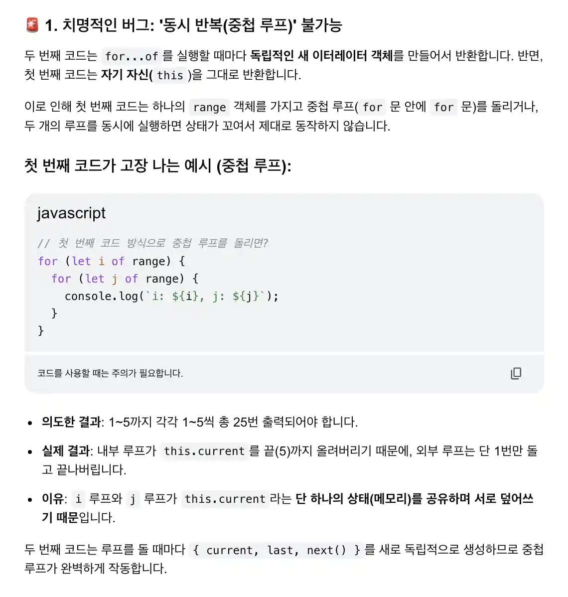

#### 참고 자료: https://ko.javascript.info/iterable

<br/>

## 1. iterable 객체
Javascript 객체의 `반복`에 대해서 다시 이야기 해보고자 한다.

일반적으로 만든 Javascript 객체에서는 `for in`문을 통해 객체 값을 순회할 수 있다. 순회 되는 프로퍼티 키값은 개발자가 작성한 프로퍼티 순서를 따르는 것이 기본이다. <font color="salmon"><b>하지만</b></font> 프로퍼티 키값들을 모두 `"49"` 또는 `49`처럼 명시했고 이 대상에게 `for in`문을 사용한다면 자동으로 숫자 오름차순이 된다.

`for in`에 대한 이야기를 했지만, 정리하면 아래와 같다.
- for in: 키(key)의 순회
- for of: 값(value)을 순회

배열의 경우는 `for in`과 `for of`를 모두 사용할 수 있다. (하지만 `for in`의 사용은 지양해야한다.)
<font color="salmon"><b>하지만</b></font> `{...}`로 만든 일반적인 객체에서는 `for of`를 사용하지 못한다.

### 1-1. 일반적인 객체는 왜 `for of`를 사용하지 못하는가?
Javascript의 약속된 규칙인 <b>`이터레이션 프로토콜`(interation Protocol)</b>을 따르는 객체만 순회할 수 있다. 

`for of`가 실행되면, 엔진은 가장 먼저 그 객체 안에 `[Symbol.iterator]`라는 특수한 메서드가 있는지 확인한다. `배열`, `문자열`, `Map` `Set`등은 이 메서드를 기본적으로 내장(Built-in)하고 있다.
반면, 일반 객체 <font color="steelblue"><b><u>`{...}`의 내부 구조를 보면 이 메서드가 없다.</u></b></font>

Javascript의 철학에 따르면 <b>배열</b>은 데이터에 순서가 생명인 자료구조이며, 
<b>객체</b>는 순서와 관계없이 키와 값의 연결 관계가 본질적인 자료구조로 정의하고 있기 때문이다.
이러한 이유로 <font color="steelblue"><b><u>"순서가 본질이 아닌 자료구조에, 순서를 전제로 동작하는 `for of`를 기본 제공하는 것은 철학적으로 맞지 않다."</u></b></font>라고 판단한 것이다.

추가적으로, `for in`도 <b>"인덱스를 기반으로 반복 가능하게 하는것 아닌가?"</b> 라는 생각을 할 수 있다. (내가 그랬다.)
Javascript의 <font color="steelblue"><b><u>`for in` 설계 당시, 순서를 보장하지 않는 '무작위 추출'에 가까웠으나 오랜 세월을 거치며 브라우저 간의 파편화와 개발자들의 요구로 인해 뒤늦게 순서 규칙이 정립된 것이다.</u></b></font>
설계 초기 `for in`은 순서가 아닌 열거의 목적을 두었다. 즉, <b>객체가 가진 모든 속성의 이름을 빠짐없이 열거하는 것이 목표였을 뿐, 순서대로 정렬해서 가져오는 것이 목적이 아니었다.</b>


### 1-2. Symbol.iterator
<b><u>우리는 일반적인 객체가 `for of`를 사용해 반복 가능한 객체로 만들어주는 것이 목표이다.</u></b>

🧑🏻‍💻 [예제 코드] 반복 가능한 객체로 만들어주기 1/2:
```javascript
let range = {
  from: 1,
  to: 5
};

// 1. for..of 최초 호출 시, Symbol.iterator가 호출됩니다.
range[Symbol.iterator] = function() {

  // Symbol.iterator는 이터레이터 객체를 반환합니다.
  // 2. 이후 for..of는 반환된 이터레이터 객체만을 대상으로 동작하는데, 이때 다음 값도 정해집니다.
  return {
    current: this.from,
    last: this.to,

    // 3. for..of 반복문에 의해 반복마다 next()가 호출됩니다.
    next() {
      // 4. next()는 값을 객체 {done:.., value :...}형태로 반환해야 합니다.
      if (this.current <= this.last) {
        return { done: false, value: this.current++ };
      } else {
        return { done: true };
      }
    }
  };
};

// 이제 의도한 대로 동작합니다!
for (let num of range) {
  alert(num); // 1, 2, 3, 4, 5
}
```
주석에 설명들이 명확하게 되어 있기 때문에 자세한 설명은 갈음하겠다.
기억해야 하는 것은 <b>`[Symbol.iterator]()`를 호출해서 만든 ‘이터레이터’객체와 이 객체의 메서드 `next()`에서 반복에 사용한다는 것이다.</b> 그리고 `next()`안의 리턴되는 객체의 프로퍼티는 `done`과 `value`가 있으며, `done`이 ture가 되면 `for of`문의 순회는 종료된다.

앞서 설명했지만 `[Symbol.iterator]()`는 `for of`를 사용하기 위한 전제조건이다.
사실 이 방법 말고도, 더 간단히 만드는 방식을 <a href="https://ko.javascript.info/iterable">참고한 레퍼런스 사이트</a>에 작성되어 있으나, 다른 방식은 아래와 같은 문제가 있기 때문에 지양해야한다고 한다.



### 1-3. 이터러블과 유사 배열
비슷해 보이지만 아주 다른 용어 두 가지가 있다.
- 이터러블: 위에서 설명한 바와 같이 메서드 `Symbol.iterator`가 구현된 객체이다.
- 유사배열(array-like): <b>인덱스</b>와 <b>`length`</b>프로퍼티가 있어서 배열처럼 보이는 객체

브라우저 등의 호스트 환경에서 Javascript를 사용해 문제를 해결할 때 이터러블 객체나 유사 배열 객체 혹은 둘 다인 객체를 만날 수 있다.

이터러블 객체 (`for..of`를 사용할 수 있음)이면서 유사배열 객체(숫자 인덱스와 `length`프로퍼티가 있음)인 문자열이 대표적인 예이다.

이터러블 객체라고 해서 유사 배열 객체는 아니다.
유사 배열 객체라고 해서 이터러블 객체인 것도 아니다.

🧑🏻‍💻[코드 예시] 유사 배열 객체이지만, 이터러블 객체가 아닌것
```javascript
let arrayLike = { // 인덱스와 length프로퍼티가 있음 => 유사 배열
  0: "Hello",
  1: "World",
  length: 2
};

// Symbol.iterator가 없으므로 에러 발생
for (let item of arrayLike) {}
```
이터러블과 유사 배열은 대개 배열이 아니기 때문에 `push`, `pop`등의 메서드를 지원하지 않는다.
이터러블과 유사 배열ㅇ르 배열처럼 다루고 싶을 때 이런 특징은 불편함을 초래한다.
앞서 설명한 `range`에 배열 메서드를 사용해 무언가를 하고 싶을 때처럼 말이다.
어떻게 하면 이터러블과 유사 배열에 배열 메서드를 적용할 수 있는지 알아본다.

#### 1-3-1. Array.from
🧑🏻‍💻[예제 코드]
```javascript
let arrayLike = {
  0: "Hello",
  1: "World",
  length: 2
};

let arr = Array.from(arrayLike); // (*)
alert(arr.pop()); // World (메서드가 제대로 동작합니다.)
```
우선, <b>arrayLike</b>는 숫자로 된 인덱스를 가지며, `length`프로퍼티가 있기 때문에 유사 배열이다.
`Array.from`은 이터러블이나 유사 배열을 진짜 `Array`로 만들어준다.
따라서, 예제 코드의 `arrayLike`는 배열이 되어, 배열 메서드를 사용할 수 있다.

🌱[문법]
```javascript
Array.from(obj[, mapFn, thisArg])
```
`mapFn`을 두 번째 인수로 넘겨주면 새로운 배열에 obj의 요소를 추가하기 전에 각 요소를 대상으로 `mapFn`을 적용할 수 있다. 새로운 배열엔 mapFn을 적용하고 반환된 값이 추가 된다. 
세 번째 인수 thisArg는 각 요소의 this를 지정할 수 있도록 해준다.

🧑🏻‍💻[예제 코드]
```javascript
let range = {
  from: 1,
  to: 5
};

// 1. for..of 최초 호출 시, Symbol.iterator가 호출됩니다.
range[Symbol.iterator] = function() {

  // Symbol.iterator는 이터레이터 객체를 반환합니다.
  // 2. 이후 for..of는 반환된 이터레이터 객체만을 대상으로 동작하는데, 이때 다음 값도 정해집니다.
  return {
    current: this.from,
    last: this.to,

    // 3. for..of 반복문에 의해 반복마다 next()가 호출됩니다.
    next() {
      // 4. next()는 값을 객체 {done:.., value :...}형태로 반환해야 합니다.
      if (this.current <= this.last) {
        return { done: false, value: this.current++ };
      } else {
        return { done: true };
      }
    }
  };
};

// 각 숫자를 제곱
let arr = Array.from(range, num => num * num);

alert(arr); // 1,4,9,16,25
```

🧑🏻‍💻[예제 코드]
```javascript
let str = '𝒳😂';

// str를 분해해 글자가 담긴 배열로 만듦
let chars = Array.from(str);

alert(chars[0]); // 𝒳
alert(chars[1]); // 😂
alert(chars.length); // 2
```

🧑🏻‍💻[예제 코드]
```javascript
let str = '𝒳😂';

let chars = []; // Array.from 내부에선 아래와 동일한 반복문이 돌아갑니다.
for (let char of str) {
  chars.push(char);
}

alert(chars);
```

🧑🏻‍💻[예제 코드]
```javascript
function slice(str, start, end) {
  return Array.from(str).slice(start, end).join('');
}

let str = '𝒳😂𩷶';

alert( slice(str, 1, 3) ); // 😂𩷶

// 내장 순수 메서드는 서로게이트 쌍을 지원하지 않습니다.
alert( str.slice(1, 3) ); // 쓰레깃값 출력 (영역이 다른 특수 값)
```