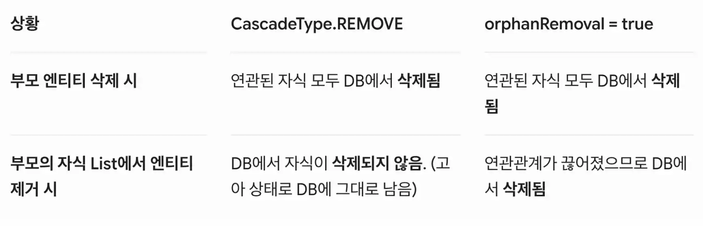

## 1. CasecadeType
기본적으로 JPA는 영속성 컨텍스트에 의해 관리되어지는 엔티티의 상태 변화를 연관된 다른 엔티티로 전파하지 않습니다. 예를 들어, 부모 객체를 persist() (저장) 한다고 해서 자식 객체까지 자동으로 저장되지 않습니다. 자식도 개별적으로 persist()를 해줘야 합니다. 이런 번거로움을 해결하고, "부모 엔티티의 상태 변화를 자식 엔티티에게도 똑같이 흘려보내겠다(Cascade)"라고 선언하는 것이 바로 영속성 전이입니다.

### 1-1. CascadeType 옵션 정리
|옵션|설명|사용빈도
|--|--|--|
| **ALL** | 아래의 모든 Cascade 옵션을 모두 적용합니다. | 매우 높음
| **PERSIST** | 부모 엔티티가 영속화(저장)될 때 자식 엔티티도 함께 영속화합니다. | 높음
| **REMOVE** | 부모 엔티티가 삭제될 때 자식 엔티티도 함께 삭제합니다. | 높음
| **MERGE** | 준영속 상태의 부모 엔티티가 병합(Update)될 때 자식도 함께 병합합니다. | 낮음
| **REFRESH** | 부모 엔티티를 DB로부터 다시 읽어올 때 자식도 함께 새로고침합니다. | 매우 낮음
| **DETACH** | 부모 엔티티가 영속성 컨텍스트에서 분리될 때 자식도 함께 분리합니다. | 매우 낮음

#### * 같이 알아두면 좋을 개념
> 